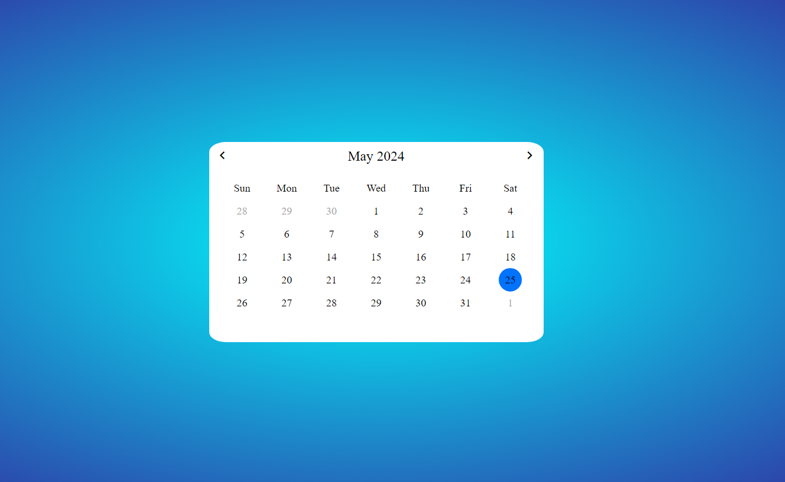

# calendar

A dynamic calendar is created using HTML, CSS, and JavaScript. 
The current date and day of the week can be viewed by users on this calendar. 
Using the previous and next icons, they are able to view the past or future month days.
 

## How to start

Just open index.html file in your browser.

## Screenshot

